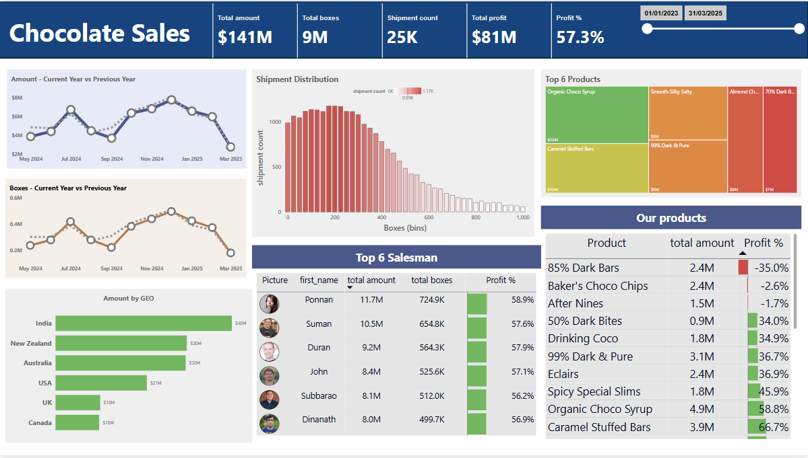

# 🍫 Chocolate Sales Dashboard – Power BI Project

📌 **Project Description:**  
This project showcases a Chocolate Sales Dashboard built using Power BI and DAX, offering rich insights into sales performance across regions, products, and top-performing sales representatives. The dashboard enables decision-makers to monitor revenue, profit trends, product profitability, and shipment metrics across a multi-year timeline.

---

## 📊 Overview

This dashboard analyzes chocolate sales data over a two-year period (2023–2025), including:

- Total revenue, profit, and shipment counts
- Time-based sales trends (monthly comparisons with previous year)
- Sales distribution by geography, products, and sales reps
- Profitability insights at product level
- Shipment behavior across bin sizes

---

## 🔧 Tools & Technologies Used

-  **Power BI** – Data visualization & reporting  
-  **DAX** – Data modeling & measures  
-  **Excel** – Data source

---

## 📌 Key Dashboard Features

| Section                         | Description |
|----------------------------------|-------------|
| 💰 **Total Metrics Cards**       | Highlights total sales amount ($141M), shipment count (25K), and profit percentage (57.3%) |
| 📉 **Monthly Trend Charts**      | Visualize trends in sales amount and boxes sold (Current vs Previous Year) |
| 📦 **Shipment Distribution**     | Histogram of shipment counts by box ranges |
| 🌍 **Amount by Geography**       | Sales value across countries including India, USA, UK, and others |
| 🧑‍💼 **Top 6 Salesmen**          | Ranked by total sales amount and profit percentages |
| 🛍️ **Top Products (Treemap)**    | Best-selling products with total revenue contribution |
| 📈 **Product Profitability Table** | Highlights which products are profitable or in loss |
| 📅 **Time Slicer**               | Interactive date range filter to control visuals dynamically |

---

## 📷 Dashboard Snapshot

---

## 📫 Contact

**Ajay Nalagampalli**  
📧 contact.ajay.n@gmail.com  
🔗 [LinkedIn](https://www.linkedin.com/in/ajay-nalagampalli)

---

## ⭐ If you found this project insightful, please give it a star!
